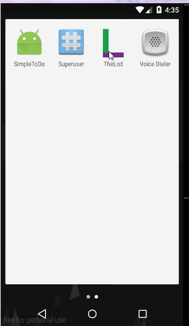

# List
'List' is an android app that helps create and manage lists in your day-to-day life. 

## Motivation
I wanted an easy-to-use list app that serves my needs. I found that other list apps were not flexible enough.
So I started making this app to help keep track of my daily lists.

## Features
In the app, you can create multiple lists with each list having multiple items. 
You can add due dates and details to your list items, and check off when complete.
You can group lists by tagging them and can view all the lists with the common tag names at one place. 
A list can also be tagged to more than one group. This helps see the same list in different contexts. 
You can delete items, lists and groups that you don't need anymore.

## Major Usecases - 
1. Add a new list. Add items to the list. 
2. Delete items from a list by swiping.
3. Add due date and details to an item in a list.
4. Check an item as done. 
5. View the items under different tabs - All, Completed, Pending.
6. Delete an existing list by swiping. Also check undo of a swipe.
7. Create a new group in the Navigation Drawer.
8. Add a list to a new group.
9. Delete a group in the Navigation Drawer(Just deletes group name, and does not delete the lists in the group).

## Video Walkthrough 
### Opening the app.

### Important usecases.

